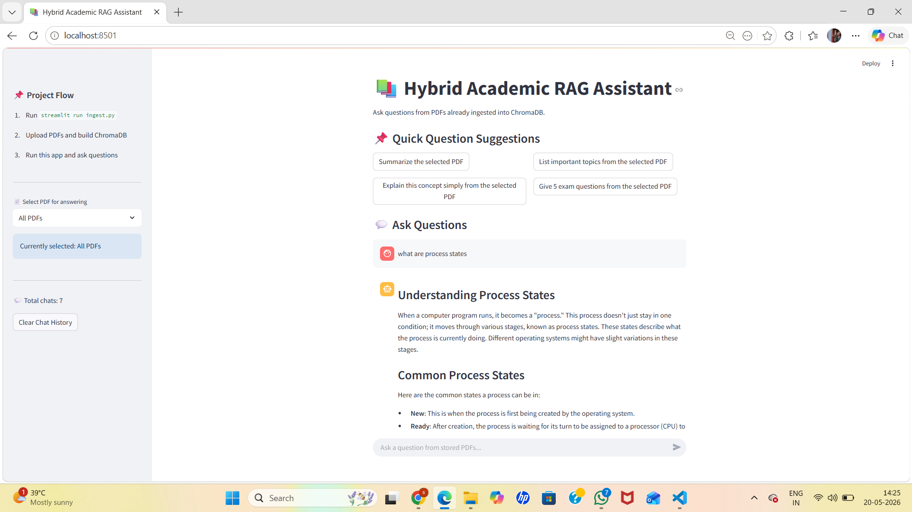
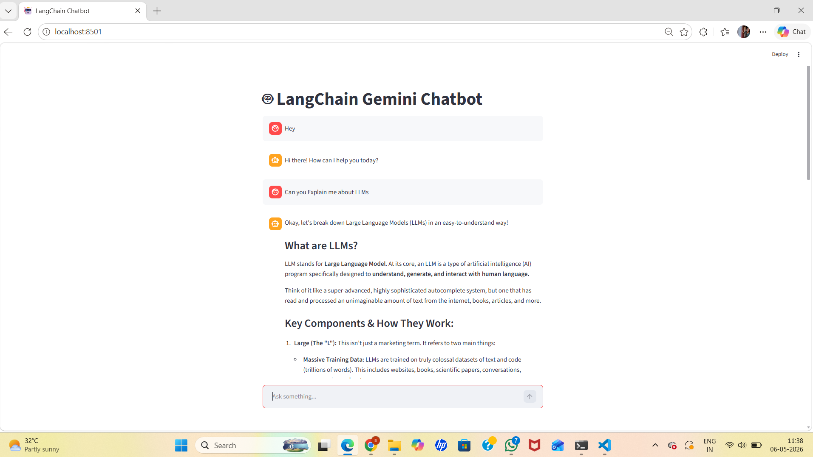
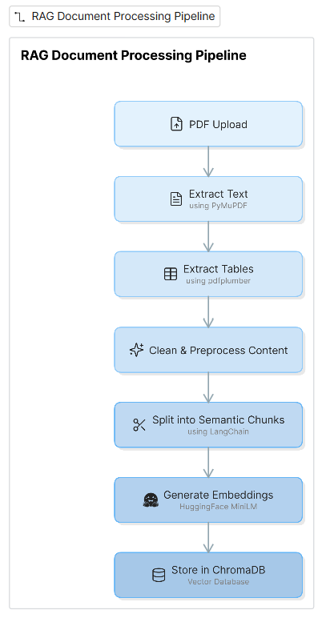

````markdown id="1clu57"
# 📚 Hybrid Academic RAG Assistant

An advanced AI-powered Hybrid Academic RAG (Retrieval-Augmented Generation) Assistant built using LangChain, Google Gemini API, ChromaDB, HuggingFace Embeddings, and Streamlit.

This system allows students to upload academic PDFs, notes, and study materials into a persistent vector database and ask intelligent context-aware questions from the stored documents.

The project follows a modular enterprise-style RAG architecture with query rewriting, semantic retrieval, reranking, prompt refinement, and grounded answer generation.

---

# 🚀 Features

## 📄 Offline PDF Ingestion Pipeline

- Upload and permanently store multiple academic PDFs
- Extract text using PyMuPDF
- Extract tables using pdfplumber
- Clean and preprocess extracted content
- Split documents into semantic chunks
- Generate embeddings using HuggingFace MiniLM
- Store embeddings permanently in ChromaDB

---

## 🤖 Advanced RAG Question Answering Pipeline

- Query rewriting for better retrieval
- Semantic similarity retrieval using ChromaDB
- CrossEncoder reranking for improved relevance
- Prompt refinement and context injection
- Grounded answer generation using Gemini 2.5 Flash
- Source citation with PDF name and page number

---

## 🧠 Smart Retrieval Features

- PDF-specific retrieval filtering
- Multi-PDF semantic search
- Persistent vector database
- Context-aware response generation
- Top-k optimized retrieval
- Semantic chunk reranking

---

## 💬 UI & User Experience

- Streamlit chat-based interface
- Persistent chat history using JSON storage
- Quick academic question suggestions
- Admin ingestion dashboard
- PDF selection dropdown
- Source transparency and retrieved details

---

# 🛠️ Technologies Used

- Python
- Streamlit
- LangChain
- Google Gemini API
- HuggingFace Embeddings
- ChromaDB
- SentenceTransformers
- CrossEncoder Reranker
- PyMuPDF
- pdfplumber
- python-dotenv
- Retrieval-Augmented Generation (RAG)

---


# 📂 Project Structure

```bash
langchain-chatbot/
│
├── app.py
├── ingest.py
├── config.py
├── requirements.txt
├── README.md
├── .gitignore
├── chat_history.json
│
├── data/
│   └── pdfs/
│
├── chroma_db/
│
├── rag/
│   ├── __init__.py
│   ├── document_loader.py
│   ├── chunker.py
│   ├── embeddings.py
│   ├── vector_store.py
│   ├── query_rewriter.py
│   ├── retriever.py
│   ├── reranker.py
│   ├── prompt_builder.py
│   ├── generator.py
│   └── pipeline.py
│
└── images/
```

---

# ⚙️ Installation & Setup

## Step 1: Clone Repository

```bash
git clone https://github.com/Sahithi-0506/chatbot.git
cd chatbot
```

---

## Step 2: Create Conda Environment

```bash
conda create -n langchain-env python=3.10 -y
conda activate langchain-env
```

---

## Step 3: Install Dependencies

```bash
pip install -r requirements.txt
```

---

## Step 4: Configure Environment Variables

Create a `.env` file in the root folder.

```env
GOOGLE_API_KEY=your_gemini_api_key
```

---

# ▶️ Running the Project

## Step 1: Run Offline PDF Ingestion Dashboard

```bash
streamlit run ingest.py
```

Upload PDFs and build ChromaDB.

---

## Step 2: Run Main Application

```bash
streamlit run app.py
```

Application runs at:

```text
http://localhost:8501
```

---

# 📥 Offline PDF Ingestion Workflow

1. User uploads academic PDFs
2. PDFs are stored inside `data/pdfs`
3. Text is extracted using PyMuPDF
4. Tables are extracted using pdfplumber
5. Extracted content is cleaned and chunked
6. HuggingFace embeddings are generated
7. Chunks are stored permanently in ChromaDB

---

# ❓ Question Answering Workflow

1. User asks a question
2. Query rewriting improves retrieval quality
3. ChromaDB performs semantic similarity search
4. Retrieved chunks are reranked using CrossEncoder
5. Relevant context is injected into prompt
6. Gemini generates grounded contextual answer
7. Source citations are displayed with PDF name and page number

---

# 🧠 Optimization Techniques

- Persistent ChromaDB vector storage
- Semantic retrieval using embeddings
- Query rewriting for improved retrieval accuracy
- CrossEncoder reranking for relevance optimization
- Modular RAG architecture
- Top-k retrieval optimization
- Chat history persistence
- PDF-specific filtering
- Context size optimization for token efficiency

---

# 🧩 Software Engineering Principles Used

## SOLID Principles

- Single Responsibility Principle
- Modular architecture
- Separation of concerns
- Reusable pipeline components
- Extensible retrieval pipeline

---

# 📸 Screenshots

## Main Chat Interface



---

## RAG Architecture Diagram



---

## Document Processing Pipeline



---

## Question Answering Pipeline

c:\Users\achyu\Pictures\Screenshots\image4.jpeg

---


# 🎯 Use Cases

- Academic doubt solving
- Exam preparation
- Notes summarization
- Concept explanation
- Quick revision
- Multi-PDF semantic search
- AI-assisted learning

---

# 🚀 Future Enhancements

- OCR support for scanned PDFs
- Gemini Vision integration
- Voice-based interaction
- Authentication system
- Cloud deployment
- Multi-user support
- Citation highlighting inside PDFs
- Hybrid search (keyword + semantic)
- Advanced agentic RAG workflows

---

# 👩‍💻 Author

## Sahithi Achyutha Ishwarya Kalla

- GitHub:
  https://github.com/Sahithi-0506

- LinkedIn:
  https://www.linkedin.com/in/sahithi-achyutha-ishwarya-kalla-317799319/

---

# 📄 License

This project is developed for educational, academic, and learning purposes.
````
