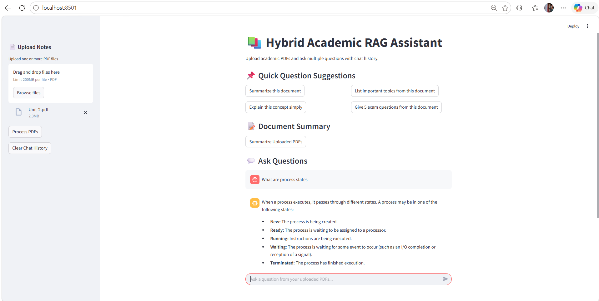
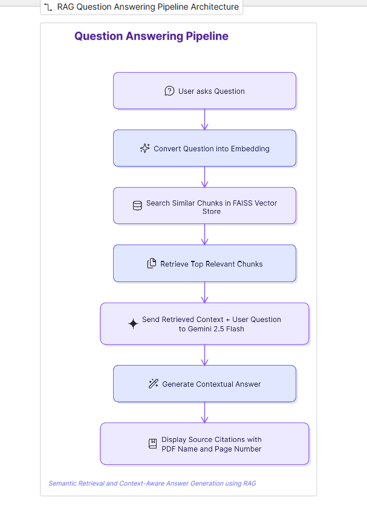
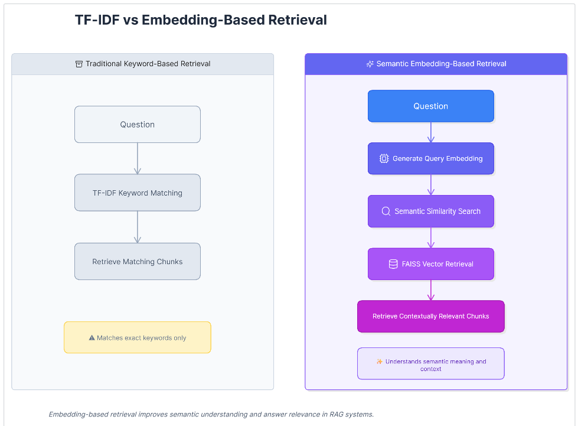

# 📚 AI Academic Study Assistant using RAG

An AI-powered Academic Study Assistant built using LangChain, Google Gemini API, Streamlit, and Retrieval-Augmented Generation (RAG).

This application allows students to upload subject PDFs, notes, or academic materials and ask questions based on the uploaded documents.

The chatbot retrieves relevant content from the uploaded PDF and generates contextual answers using Gemini AI.

---

## 🚀 Features

- 📄 Upload multiple academic PDF documents
- 🤖 AI-powered academic question answering
- 🔍 Retrieval-Augmented Generation (RAG) workflow
- 🧠 Semantic document retrieval using HuggingFace embeddings
- ⚡ FAISS Vector Store for fast similarity search
- 📚 Context-based answers from uploaded study materials
- 📌 Source citation with PDF name and page number
- 💬 Chat history using Streamlit session state
- 📝 Document summary generation
- 📌 Quick question suggestion buttons
- 🚀 Caching for embedding model optimization
- 🎯 Token consumption optimization using top-k retrieval and limited chat history
- 🔐 Secure API key handling using `.env`

---

## 🛠️ Technologies Used

- Python
- Streamlit
- LangChain
- Google Gemini API
- HuggingFace Embeddings
- FAISS Vector Store
- PyPDF2
- python-dotenv
- RAG Architecture

---

# 📂 Project Structure

```bash
langchain-chatbot/
│
├── app.py
├── requirements.txt
├── README.md
├── .env
├── .gitignore
```

---

# ⚙️ Installation

## Step 1: Clone Repository

```bash
git clone https://github.com/YOUR_USERNAME/langchain-chatbot.git
cd langchain-chatbot
```

## Step 2: Create Conda Environment

```bash
conda create -n langchain-env python=3.10 -y
conda activate langchain-env
```

## Step 3: Install Dependencies

```bash
pip install -r requirements.txt
```

---

# 🔑 API Configuration

Create a `.env` file in the project folder.

Add your Gemini API key:

```env
GOOGLE_API_KEY=your_api_key_here
```

---

# ▶️ Run the Application

```bash
streamlit run app.py
```

Application runs at:

```bash
http://localhost:8501
```

---

## 💡 How It Works

1. User uploads one or more academic PDF documents.
2. Text is extracted from PDFs using PyPDF2.
3. Extracted text is split into smaller chunks using LangChain text splitter.
4. Each chunk is converted into embeddings using HuggingFace MiniLM embeddings.
5. Embeddings are stored in FAISS Vector Store.
6. When the user asks a question, the system performs semantic similarity search.
7. The top relevant chunks are retrieved from FAISS.
8. Retrieved context and user question are sent to Gemini AI.
9. Gemini generates a context-aware academic answer.
10. The app displays the answer along with source citation.

---

## ⚙️ Optimization

- Used local HuggingFace embeddings to reduce Gemini API dependency.
- Cached the embedding model using Streamlit `cache_resource`.
- Reduced chunk size and chunk overlap for better retrieval efficiency.
- Limited top-k retrieval to reduce unnecessary context.
- Limited chat history sent to Gemini to reduce token consumption.

---


# 📸 Output Screenshot



## RAG Architecture Diagram


## 📄 Document Processing Pipeline

The uploaded academic PDFs are processed step by step before answering user questions.


## ❓ Question Answering Pipeline

The system retrieves semantically relevant document chunks and generates grounded answers using Gemini.



## 🔄 TF-IDF vs Embedding-Based Retrieval

The project was initially implemented using TF-IDF keyword matching and later upgraded to embedding-based semantic retrieval using HuggingFace embeddings and FAISS vector search.




---

# 🎯 Use Cases

- Exam preparation
- Quick revision
- Concept clarification
- Academic doubt solving
- Notes summarization

---

# 🚀 Future Enhancements

- Add chat history support
- Add voice assistant integration
- Add multi-subject organization
- Implement vector databases like FAISS
- Add authentication system
- Deploy advanced RAG pipeline

---

# 👩‍💻 Author

**Sahithi Achyutha Ishwarya Kalla**

- GitHub: https://github.com/Sahithi-0506
- LinkedIn: https://www.linkedin.com/in/sahithi-achyutha-ishwarya-kalla-317799319/

---

# 📄 License

This project is created for educational and learning purposes.